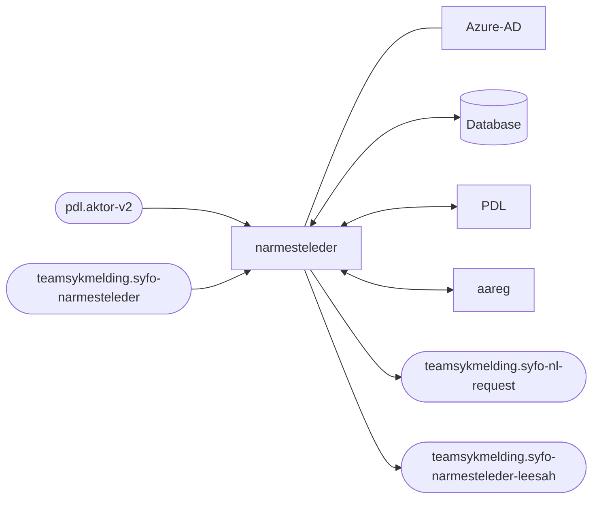

# narmesteleder
This project contains the application code and infrastructure for narmesteleder

## Technologies used
* Kotlin
* Ktor
* Gradle
* Junit
* Docker

### :scroll: Prerequisites
* JDK 21
Make sure you have the Java JDK 21 installed
You can check which version you have installed using this command:
``` shell
java -version
```

* Docker
Make sure you have the Docker installed
You can check which version you have installed using this command:
``` shell
docker -version
```

## FlowChart
This the high level flow of the application


## Getting started
### Building the application
#### Compile and package application
To build locally and run the integration tests you can simply run
``` shell
./gradlew shadowJar
```
or on windows 
`gradlew.bat shadowJar`

#### Creating a docker image
Creating a docker image should be as simple as
``` shell
docker build -t narmesteleder .
```

#### Running a docker image
``` shell
docker run --rm -it -p 8080:8080 narmesteleder
```

### Upgrading the gradle wrapper

Find the newest version of gradle here: https://gradle.org/releases/ Then run this command:

``` shell
./gradlew wrapper --gradle-version $gradleVersjon
```

### Contact

This project is maintained by [navikt/teamsykmelding](CODEOWNERS)

Questions and/or feature requests? Please create an [issue](https://github.com/navikt/narmesteleder/issues)

If you work in [@navikt](https://github.com/navikt) you can reach us at the Slack
channel [#team-sykmelding](https://nav-it.slack.com/archives/CMA3XV997)
